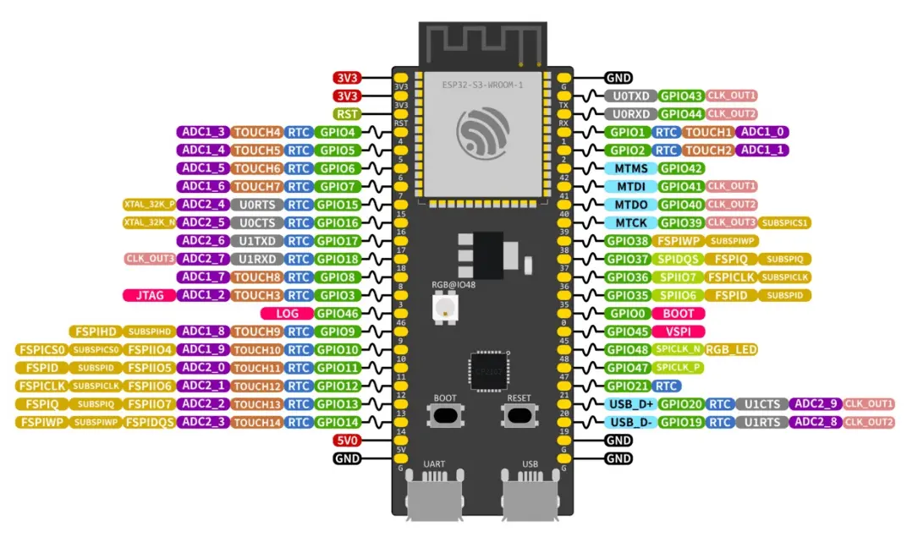

## Overview

The ESP32-S3 is the main controller used in my portable lab-station project. It coordinates the display, buttons, menu system, wireless features, signal-generation functions, and future measurement tools.

The board is useful because it combines general GPIO, communication peripherals, wireless connectivity, USB support, and enough processing capability for interactive embedded projects.

## Pinout

## Key Specifications

The exact capabilities and exposed pins can vary between development-board manufacturers. The board schematic, silkscreen, and product documentation should always be checked before final wiring.

- **MCU Platform:** ESP32-S3
- **Board Configuration:** N16R8 label
- **GPIO Logic:** 3.3 V
- **Power Entry:** USB or supported board input
- **Wireless:** Wi-Fi and Bluetooth support
- **Development Use:** Control, UI, communication, and testing

## Safety

>[!WARNING] Input Protection
> Treat the GPIO as 3.3 V logic. Do not connect an unknown or 5 V signal directly to an ESP32-S3 GPIO pin. Use a suitable divider, level shifter, or interface circuit when necessary.

- Connect all communicating circuits to a common ground.
- Confirm the voltage of every external signal before connecting it to a GPIO pin.
- Do not assume every pin is suitable for ADC, USB, boot control, or high-speed operation.
- Verify the board documentation before powering through a 5 V, VIN, or external-power pin.
- Avoid changing several wiring and firmware variables at the same time during debugging.

## Practical Notes

### 1. Confirm the exact board variant

> Development boards can expose different pins and include different supporting circuits.

### 2. Reserve pins before soldering

> Plan I²C, buttons, analog inputs, signal outputs, and future expansion together.

### 3. Test one subsystem at a time

> Verify the display, buttons, output, and measurement features independently before integration.

### 4. Add input protection

> Measurement inputs require suitable scaling, current limiting, and voltage protection.

