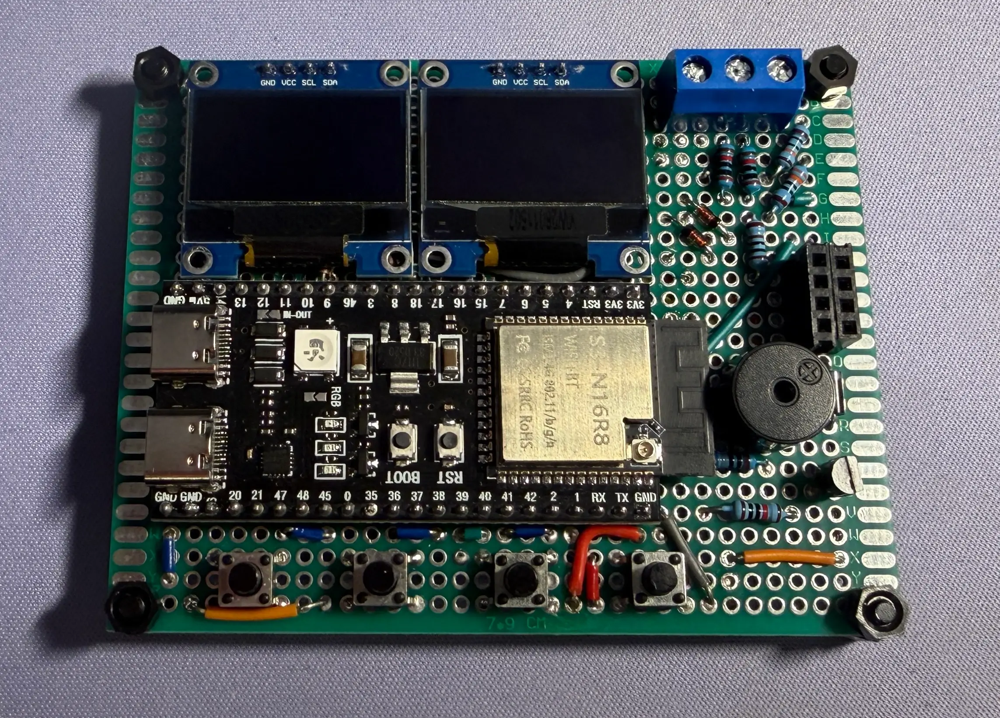

## Overview

### Why I am building it

Electrical engineering projects often require several separate tools: an oscilloscope, signal generator, logic analyzer, development board, and computer.

This project explores how many basic laboratory functions can be integrated into one compact, programmable platform.

The ESP32-S3 acts as the central controller. It manages the OLED interface, user input, waveform generation, analog sampling, digital signal capture, wireless communication, and future hardware expansion.

The goal is not to replace professional laboratory equipment. The goal is to create a portable learning tool for debugging low-voltage embedded systems and documenting the engineering decisions behind it.

### Project Goals

- Portable and USB-powered
- Modular software architecture
- Expandable hardware interfaces
- Safe low-voltage signal testing
- Clear documentation and revision history

## Features

The project is being developed incrementally so that each subsystem can be tested independently before integration.

> [!IMPLEMENTED] OLED Menu System
> A multi-level user interface controlled by physical buttons and designed for future tool expansion.

> [!PROTOTYPE] Signal Generator
> Configurable PWM waveform generation with adjustable frequency and duty cycle.

> [!PROTOTYPE] Oscilloscope
> ADC-based waveform sampling with basic voltage measurement and OLED visualization.

> [!PLANNED] Logic Analyzer
> Multi-channel digital capture for observing timing, communication protocols, and embedded signals.

## Architecture

The platform separates user input, signal processing, and output functions into independent subsystems.

### Input Layer — Controls and Signals

- Physical buttons
- Analog signal input
- Digital logic channels
- I²C peripherals

### Processing Layer — ESP32-S3

- Menu state management
- ADC sampling
- PWM generation
- Data processing

### Output Layer — Display and Interfaces

- OLED visualization
- Signal output
- USB communication
- Wi-Fi connectivity

## Circuit Structure

## Media

Hardware photos, interface screenshots, and measurement results will be added as each subsystem is developed and verified.

### OLED Menu Screenshot

A clear photo or screenshot showing the multi-level tool-selection interface.

### Prototype Assembly

A photo documenting the ESP32-S3, OLED, buttons, wiring, and prototype-board layout.

### Waveform Test Result

An oscilloscope capture or test screenshot showing the generated frequency and duty cycle.

## Pin Assignment

Confirmed interface pins are documented first. Measurement and signal pins will be finalized after the protection and analog front-end design is complete.

| Function | GPIO | Status | Notes |
| :--- | :---: | :--- | :--- |
| I²C SDA | `GPIO 8` | Confirmed | Shared OLED and peripheral data line |
| I²C SCL | `GPIO 9` | Confirmed | Shared OLED and peripheral clock line |
| Up / Left Button | `GPIO 48` | Confirmed | Configured with internal pull-up |
| Down / Right Button | `GPIO 39` | Confirmed | Configured with internal pull-up |
| Confirm Button | `GPIO 40` | Confirmed | Menu selection input |
| Signal Output | `TBD` | Under Review | Final PWM-capable pin not yet assigned |
| Oscilloscope Input | `TBD` | Under Review | Requires an ADC pin and protected front end |

## Roadmap

### 01 — Stabilize the menu architecture

Separate display, input, and tool logic into maintainable software modules.

### 02 — Build the analog input front end

Add voltage limiting, scaling, filtering, and protection before connecting external signals.

### 03 — Implement digital signal capture

Develop buffered multi-channel sampling for the logic analyzer subsystem.

### 04 — Design a custom carrier PCB

Move from a prototype board to an organized, protected, and expandable hardware platform.

